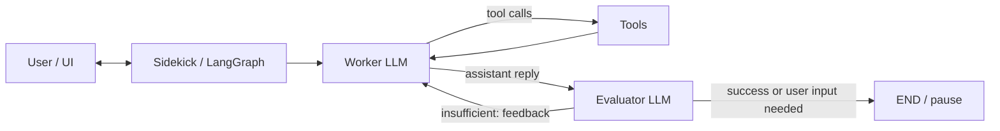

# Browser Sidekick Agent (Operator-Style AI)

An autonomous, operator-style AI agent that plans, executes, and self-corrects multi-step tasks using LangGraph and tool-augmented LLMs.

Unlike traditional chatbots, this Sidekick acts as an Operator:
- Interacts with web apps (click, type, navigate) via tools
- Uses search, files, Python, and optional browser automation
- Evaluates its own work and iterates until success or a controlled stop

Status: Complete developer baseline with typed configuration, state models, worker/evaluator nodes, tools, LangGraph wiring, memory resume, OpenAI/OpenRouter builders, a minimal Gradio UI, and tests.

Example:
“Find flight tickets under $500 and summarize the best options”
→ The agent searches, navigates websites, extracts data, and validates results automatically.

---

## Features

- Self-evaluating worker/evaluator loop with iteration cap
- Tooling: sandboxed files, search, Wikipedia, Python REPL, notifications, optional browser
- Sessions: in-memory checkpointing with `thread_id` resume
- Config: type-safe env settings (`src/config.py`)
- UI: minimal Gradio chat; programmatic API
- Tracing: LangSmith-ready (tags/metadata), plus structured logs

---

## Why This Matters

Most AI systems are passive—they answer questions. This project demonstrates Action-Oriented AI where agents:
- Perform real tasks (not just respond)
- Interact with external systems (browser, APIs)
- Self-evaluate and improve results
- Operate safely with human-in-the-loop controls

Directly applicable to:
- Digital onboarding and KYC automation
- Browser automation and QA testing
- Customer support workflows and knowledge ops
- Financial services orchestration

---

## Repository layout

| Path | Purpose |
|------|---------|
| `src/config.py` | Typed environment settings (`Settings`, `get_settings()`). |
| `src/state.py` | `AgentState` and `EvaluatorOutput` (Pydantic). |
| `src/llm/` | `BaseLLMClient`, `OpenAIClient`. |
| `src/utils/prompts.py` | Worker and evaluator prompt builders (including evaluator JSON instruction). |
| `src/utils/parsing.py` | Parses evaluator LLM text into `EvaluatorOutput`. |
| `src/agents/worker.py` | Worker node: normalises history, builds the LLM request, runs the model. |
| `src/agents/evaluator.py` | Evaluator node: builds request, parses structured output, updates flags. |
| `src/agents/graph.py` | `SidekickGraphState`, `compile_sidekick_graph`, `create_sidekick_graph_from_settings`, routers. |
| `src/tools/` | `SidekickTool`, registry, sandbox files, search, Wikipedia, Python, Pushover, Playwright. |
| `src/ui/` | `api.py` helpers, `gradio_app.py` chat UI. |
| `tests/unit/` | Unit tests. |
| `docs/developer.md` | Developer guide: ownership, config, testing, change log. |

---

## Quick start

### Prerequisites

- [uv](https://github.com/astral-sh/uv) (recommended)
- Python 3.12+

### Environment

Create a `.env` and add your keys:

```bash
cat > .env <<'EOF'
# Choose OpenAI or OpenRouter
# OPENAI_API_KEY=sk-...
# Models (defaults to gpt-4o-mini)
# OPENAI_MODEL_WORKER=gpt-4o-mini
# OPENAI_MODEL_EVALUATOR=gpt-4o-mini

# Or OpenRouter (recommended when you can't use OpenAI directly)
# OPENROUTER_API_KEY=...
# OPENROUTER_BASE_URL=https://openrouter.ai/api/v1
# OPENROUTER_MODEL_WORKER=openai/gpt-4o-mini
# OPENROUTER_MODEL_EVALUATOR=openai/gpt-4o-mini

# Graph and tools
MAX_AGENT_ITERATIONS=8
LLM_TIMEOUT_SECONDS=30
# SERPER_API_KEY=...    # enables web search

# Tracing (LangSmith)
# LANGCHAIN_TRACING_V2=true
# LANGCHAIN_ENDPOINT=https://api.smith.langchain.com
# LANGCHAIN_API_KEY=...
# LANGCHAIN_PROJECT=operator-sidekick
EOF
```

Then load it:

```bash
set -a; source .env; set +a
```

### Run tests

```bash
uv run --with pytest --with pydantic pytest -q
uv run --with pytest --with pydantic --with langgraph --with langchain-core --with langchain-openai pytest -q tests/unit/
```

Focused suites:

```bash
uv run --with pytest --with pydantic pytest -q tests/unit/test_state.py
uv run --with pytest --with pydantic pytest -q tests/unit/test_llm_base.py tests/unit/test_openai_client.py
uv run --with pytest --with pydantic pytest -q tests/unit/test_prompts.py
uv run --with pytest --with pydantic pytest -q tests/unit/test_worker.py
uv run --with pytest --with pydantic pytest -q tests/unit/test_evaluator.py
uv run --with pytest --with pydantic pytest -q tests/unit/test_tools/
```

### Run the app

Dev runner (auto-detects OpenRouter if credentials are set):

```bash
bash scripts/run_dev.sh
```

Gradio UI:

```bash
bash scripts/run_ui.sh
```

---

## Configuration

Common variables (full list: `docs/developer.md`):

| Variable | Role |
|----------|------|
| `OPENAI_API_KEY` | Credential for OpenAI. |
| `OPENAI_MODEL_WORKER` / `OPENAI_MODEL_EVALUATOR` | Default model IDs (default: gpt-4o-mini). |
| `OPENROUTER_API_KEY`, `OPENROUTER_BASE_URL` | OpenRouter support. |
| `OPENROUTER_MODEL_WORKER` / `OPENROUTER_MODEL_EVALUATOR` | OpenRouter slugs (defaults to OpenAI values). |
| `OPENAI_MAX_TOKENS` / `OPENROUTER_MAX_TOKENS` | Token caps per call (default 512). |
| `LLM_TIMEOUT_SECONDS` | HTTP client timeout. |
| `MAX_AGENT_ITERATIONS` | Safety cap for graph loops. |
| `SANDBOX_DIR` / `SESSION_STORE_DIR` | Local sandbox and session storage roots. |
| `BROWSER_HEADLESS` | Playwright visibility. |
| `SERPER_API_KEY`, `PUSHOVER_*` | Optional integrations. |

---

## Architecture

Control flow:



Key details:
- `src/agents/graph.py`: worker → optional tools → evaluator → (END or worker), with iteration cap and resume
- Evaluator feedback is stored as a system message; UI shows only the final assistant answer
- `src/sidekick.py`: builders for OpenAI and OpenRouter (with token caps)

---

## How It Works (Simple Flow)

1. User provides a task (e.g., “Find flight tickets under $500”).
2. Worker LLM plans and executes, using tools as needed:
   - Open browser (Playwright)
   - Search the web
   - Extract or generate outputs
3. Evaluator LLM reviews the result:
   - If correct → finish
   - If not → provide feedback and retry
   - If unclear → ask for user input
4. Loop continues until success, user input, or safe stop (iteration cap).
5. State is checkpointed by `thread_id` to support resume.

---

## Key Design Decisions

- Two-LLM architecture: Worker (execution) and Evaluator (quality control)
- LangGraph for orchestration: stateful, multi-step workflows with explicit routing
- Tool-augmented AI: search, Wikipedia, files, Python REPL, notifications, optional browser
- Persistent memory: `thread_id`-scoped checkpointing and resume
- Human-in-the-loop safety: evaluator can pause for clarification; iteration caps and token caps
- Tracing + observability: LangSmith tagging/metadata and structured logging

---

## Tracing and metrics

Enable LangSmith tracing (optional):

```bash
export LANGCHAIN_TRACING_V2=true
export LANGCHAIN_ENDPOINT=https://api.smith.langchain.com
export LANGCHAIN_API_KEY=your_key
export LANGCHAIN_PROJECT=operator-sidekick
```

Recommended quality metrics:
- Evaluator acceptance rate (finality)
- Iterations to success (loop health)
- Total tokens per run (financial)
- Tool success rate by tool (reliability)
- End-to-end latency p50/p95 (UX)

---

## Business Impact

- Reduced manual work via safe automation
- Faster onboarding flows (e.g., KYC document handling)
- Improved reliability with self-evaluation and controlled retry
- Cost optimization via token caps and early-stop logic
- Scalable operations with multi-session, resumable state

Fintech examples:
- KYC automation and compliance workflows
- Fraud investigation assisted tooling (document search/summarization)
- Customer onboarding and verification journeys

---

## Evaluation Strategy

The evaluator uses structured outputs to ensure quality across:
- Task completion validation against success criteria
- Iteration progress tracking and loop health
- Tool usage correctness and error surface area
- Output quality checks (format, length, constraints)
- Safety and user-clarification detection

This yields reliable, safe, and cost-aware behavior:
- Reliable: high acceptance rate, fewer retries
- Safe: pauses for clarification when ambiguous
- Cost-efficient: tokens and iterations capped

---

## Documentation

| Resource | Use it for |
|----------|------------|
| [`docs/developer.md`](docs/developer.md) | Change protocol, module ownership, config contract, testing matrix, and change log. |

---

## License

See `LICENSE`.

---

## Contributing

1. Implement or change behaviour with tests.
2. Update `docs/developer.md` (change log, config, testing notes as applicable).
3. Verify locally:

   ```bash
   uv run --with pytest --with pydantic pytest -q
   ```

4. Open a pull request with a clear summary and test results.

---

## Author

Haben E. Akelom  
Senior Software & AI Engineer | AI Systems

- Designed and implemented Sidekick architecture
- Built LangGraph orchestration and evaluator loop
- Integrated tool ecosystem and checkpointing
- Focused on production-grade AI systems with tracing and metrics

