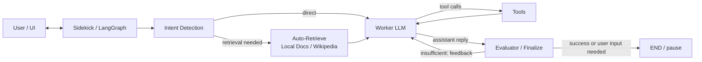

# Sidekick — Operator-Style AI Agent

An autonomous, operator-style AI agent that plans, executes, and self-corrects multi-step tasks using LangGraph and tool-augmented LLMs.

Unlike traditional chatbots, Sidekick acts as an **Operator** — it performs real tasks, interacts with external systems, self-evaluates its own output, and iterates until success or a controlled stop.

> "Find flight tickets under $500 and summarize the best options"
> → The agent searches, navigates websites, extracts data, and validates results automatically.

---

## Features

- **Worker / Evaluator loop** — two-LLM architecture with iteration cap and token budget enforcement
- **Tool ecosystem** — sandboxed file I/O, web search (Serper), Wikipedia, Python REPL, Pushover notifications, optional Playwright browser automation
- **Multi-provider LLM support** — OpenAI, OpenRouter, and local Ollama (llama3.1:8b and compatible models)
- **Intent detection + auto-retrieval** — automatically grounds factual and overview queries in local docs or Wikipedia before the worker runs
- **Session memory** — in-memory checkpointing with `thread_id` resume via LangGraph
- **Observability UI** — Gradio chat with live metrics dashboard (acceptance rate, latency p50/p95, token usage, tool reliability)
- **LangSmith tracing** — tags/metadata on every run; structured logging throughout
- **Type-safe config** — all settings driven by environment variables via `src/config.py`

---

## Why This Matters

Most AI systems are passive — they answer questions. Sidekick demonstrates **Action-Oriented AI** where agents:

- Perform real tasks, not just respond
- Interact with external systems (browser, APIs, files)
- Self-evaluate and improve results through iteration
- Operate safely with human-in-the-loop controls and hard stop conditions

Directly applicable to:
- Digital onboarding and KYC automation
- Browser automation and QA testing
- Customer support workflows and knowledge ops
- Financial services orchestration

---

## Architecture



**Key details:**

- `src/agents/graph.py` — full graph: intent → auto-retrieve → worker → optional tools → evaluator/finalize, with iteration cap and resume
- `src/sidekick.py` — provider builders for OpenAI, OpenRouter, and Ollama
- Ollama path runs without tool binding (straight-line mode) — local 8B models reliably default to tool calls over text answers when tools are bound; auto-retrieve handles grounding instead
- Evaluator feedback is stored as a `SystemMessage`; the UI shows only the final assistant answer

---

## Repository Layout

| Path | Purpose |
|------|---------|
| `src/config.py` | Typed env settings (`Settings`, `get_settings()`). |
| `src/state.py` | `AgentState` and `EvaluatorOutput` (Pydantic). |
| `src/llm/` | `BaseLLMClient`, `OpenAIClient`. |
| `src/utils/prompts.py` | Worker and evaluator prompt builders. |
| `src/utils/parsing.py` | Parses evaluator LLM text into `EvaluatorOutput`. |
| `src/agents/worker.py` | Worker node: normalises history, builds LLM request. |
| `src/agents/evaluator.py` | Evaluator node: builds request, parses structured output, updates flags. |
| `src/agents/graph.py` | `SidekickGraphState`, `compile_sidekick_graph`, routers, intent detection, auto-retrieve. |
| `src/tools/` | `SidekickTool`, registry, sandbox files, search, Wikipedia, Python REPL, Pushover, Playwright. |
| `src/ui/` | `api.py` helpers, `gradio_app.py` chat + observability UI. |
| `src/metrics.py` | In-process counters and histograms; `get_metrics_summary()`. |
| `tests/unit/` | Unit tests. |
| `docs/developer.md` | Developer guide: module ownership, config contract, testing matrix, change log. |

---

## Quick Start

### Prerequisites

- [uv](https://github.com/astral-sh/uv) (recommended) or Python 3.12+

### Environment

```bash
cat > .env <<'EOF'
# --- OpenAI ---
# OPENAI_API_KEY=sk-...
# OPENAI_MODEL_WORKER=gpt-4o-mini
# OPENAI_MODEL_EVALUATOR=gpt-4o-mini

# --- OpenRouter (recommended if you can't use OpenAI directly) ---
# OPENROUTER_API_KEY=...
# OPENROUTER_BASE_URL=https://openrouter.ai/api/v1
# OPENROUTER_MODEL_WORKER=openai/gpt-4o-mini
# OPENROUTER_MODEL_EVALUATOR=openai/gpt-4o-mini

# --- Ollama (local) ---
# OLLAMA_BASE_URL=http://localhost:11434
# OLLAMA_MODEL_WORKER=llama3.1:8b
# OLLAMA_MODEL_EVALUATOR=llama3.1:8b

# --- Graph ---
MAX_AGENT_ITERATIONS=8
LLM_TIMEOUT_SECONDS=30

# --- Optional integrations ---
# SERPER_API_KEY=...       # enables web search tool
# PUSHOVER_TOKEN=...
# PUSHOVER_USER=...

# --- LangSmith tracing ---
# LANGCHAIN_TRACING_V2=true
# LANGCHAIN_ENDPOINT=https://api.smith.langchain.com
# LANGCHAIN_API_KEY=...
# LANGCHAIN_PROJECT=operator-sidekick
EOF

set -a; source .env; set +a
```

### Run the UI

```bash
# Gradio chat + observability dashboard
bash scripts/run_ui.sh

# Or directly
uv run --with langchain-community --with langchain-core --with langgraph --with gradio python -m src.ui.gradio_app
```

### Run Tests

```bash
uv run --with pytest --with pydantic pytest -q
uv run --with pytest --with pydantic --with langgraph --with langchain-core --with langchain-openai pytest -q tests/unit/
```

---

## Configuration

| Variable | Default | Role |
|----------|---------|------|
| `OPENAI_API_KEY` | — | OpenAI credential. |
| `OPENAI_MODEL_WORKER` / `OPENAI_MODEL_EVALUATOR` | `llama3.1:8b` | Worker / evaluator model IDs. |
| `OPENROUTER_API_KEY`, `OPENROUTER_BASE_URL` | — | OpenRouter support. |
| `OPENROUTER_MODEL_WORKER` / `OPENROUTER_MODEL_EVALUATOR` | — | OpenRouter model slugs. |
| `OPENAI_MAX_TOKENS` / `OPENROUTER_MAX_TOKENS` | `512` | Token cap per LLM call. |
| `OLLAMA_BASE_URL` | — | Ollama server URL (enables local mode). |
| `OLLAMA_MODEL_WORKER` / `OLLAMA_MODEL_EVALUATOR` | `llama3.1:8b` | Ollama model names. |
| `LLM_TIMEOUT_SECONDS` | `30` | HTTP client timeout. |
| `MAX_AGENT_ITERATIONS` | `8` | Safety cap for graph loops. |
| `TOKENS_PER_RUN_LIMIT` | `50000` | Approximate token kill-switch per run. |
| `HISTORY_CHAR_LIMIT` | `8000` | Max chars of conversation history sent to LLM. |
| `SANDBOX_DIR` / `SESSION_STORE_DIR` | `./sandbox`, `./.sessions` | Local storage roots. |
| `BROWSER_HEADLESS` | `false` | Playwright headless mode. |
| `SERPER_API_KEY` | — | Enables web search tool. |
| `PUSHOVER_TOKEN` / `PUSHOVER_USER` | — | Pushover notification credentials. |

Full reference: `docs/developer.md`.

---

## How It Works

1. **User sends a task** — e.g. "Find flight tickets under $500".
2. **Intent detection** — the graph checks if the query needs factual retrieval (overview, definitions, external data).
3. **Auto-retrieve** — if needed, local docs (README, developer guide) or Wikipedia are fetched and injected into context before the worker runs.
4. **Worker LLM** — plans and executes, calling tools as needed (search, browser, Python REPL, files).
5. **Evaluator / Finalize** — reviews the result against success criteria:
   - Accepted → end
   - Rejected → feedback sent back to worker for retry
   - Unclear → pause and ask user
6. **Loop** continues until success, user input needed, or iteration/token cap hit.
7. **State checkpointed** by `thread_id` — sessions are resumable.

---

## Observability

The Gradio UI includes a live **Observability** panel with:

- **Acceptance rate** — evaluator finality (% of runs accepted on first pass)
- **Iterations p95** — loop health; high values indicate the worker is struggling
- **Latency p50 / p95** — end-to-end response time
- **Avg tokens / run** — cost proxy
- **Tool reliability chart** — per-tool success rate
- **Latency distribution** — histogram with p50/p95 reference lines
- **Token usage trend** — per-run token count over time

Enable LangSmith for full distributed tracing:

```bash
export LANGCHAIN_TRACING_V2=true
export LANGCHAIN_ENDPOINT=https://api.smith.langchain.com
export LANGCHAIN_API_KEY=your_key
export LANGCHAIN_PROJECT=operator-sidekick
```

---

## LLM Provider Notes

| Provider | Tools | Evaluator | Notes |
|----------|-------|-----------|-------|
| OpenAI / OpenRouter | ✅ Full tool binding | ✅ Structured output | Recommended for production. |
| Ollama (local) | ❌ Disabled | ✅ Heuristic fallback | 8B models default to tool calls over text when tools are bound; auto-retrieve handles grounding. Use `llama3.1:8b` or larger. |

---

## Business Impact

- Reduced manual work via safe, auditable automation
- Faster onboarding flows (e.g., KYC document handling)
- Improved reliability with self-evaluation and controlled retry
- Cost optimization via token caps and early-stop logic
- Scalable operations with multi-session, resumable state

Fintech examples:
- KYC automation and compliance workflows
- Fraud investigation tooling (document search and summarisation)
- Customer onboarding and verification journeys

---

## Contributing

1. Implement or change behaviour with tests.
2. Update `docs/developer.md` (change log, config, testing notes).
3. Verify locally:

   ```bash
   uv run --with pytest --with pydantic pytest -q
   ```

4. Open a pull request with a clear summary and test results.

---

## License

See `LICENSE`.

---

## Author

Haben E. Akelom — Senior Software & AI Engineer | AI Systems

- Designed and implemented Sidekick architecture
- Built LangGraph orchestration, evaluator loop, and intent/auto-retrieve pipeline
- Integrated tool ecosystem, multi-provider LLM support, and checkpointing
- Built observability UI with live metrics dashboard
