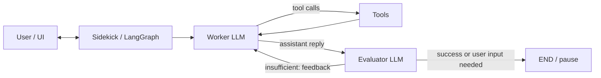

# Browser Sidekick Agent

An **operator-style**, tool-augmented AI agent built with **LangGraph**. The design centers on a **worker / evaluator** loop: the worker drives task execution (including tools once integrated), and the **evaluator** scores the latest result against **success criteria** to decide whether to **retry with feedback**, **finish**, or **pause for human clarification**.

**Current status:** Foundational layers are in place—typed configuration, Pydantic state, a provider-agnostic LLM abstraction (with an OpenAI adapter), centralized prompts, evaluator JSON parsing, and **implemented worker and evaluator nodes** with unit tests. **Next milestones:** LangGraph wiring (`src/agents/graph.py`), first-class **tools** under `src/tools/`, **memory and checkpointing** (`src/memory/`), and a **Gradio** UI (`src/ui/`).

---

## Features (target architecture)

| Area | What you get |
|------|----------------|
| **Self-evaluation** | Worker + evaluator models iterate until success or a controlled stop for user input. |
| **Tooling** | Browser (Playwright), sandboxed files, web search, Python REPL, Wikipedia, notifications—**to be implemented under `src/tools/`**. |
| **Sessions** | Checkpointing and **`thread_id`**-scoped state for long runs—**planned under `src/memory/`**. |
| **Configuration** | **Type-safe** settings from the environment via `Settings` / `get_settings()` in `src/config.py`. |
| **State & prompts** | **`AgentState`**, **`EvaluatorOutput`**, and shared prompt builders in `src/utils/prompts.py`. |

---

## Repository layout

| Path | Purpose |
|------|---------|
| `src/config.py` | Typed environment settings (`Settings`, `get_settings()`). |
| `src/state.py` | `AgentState` and `EvaluatorOutput` (Pydantic). |
| `src/llm/` | `BaseLLMClient`, `OpenAIClient`, request/response DTOs. |
| `src/utils/prompts.py` | Worker and evaluator prompt builders (including evaluator JSON instruction). |
| `src/utils/parsing.py` | Parses evaluator LLM text into `EvaluatorOutput` (raw JSON or fenced code block). |
| `src/agents/worker.py` | Worker node: normalises history, builds the LLM request, runs the model, returns updated state. |
| `src/agents/evaluator.py` | Evaluator node: builds evaluator request, parses structured output, updates flags and transcript. |
| `src/agents/graph.py` | LangGraph construction (**planned**). |
| `src/tools/` | Tool implementations (scaffold; **not yet wired** to the worker). |
| `src/ui/` | Gradio app (**planned**). |
| `tests/unit/` | Unit tests (**run with `uv`**). |
| `docs/developer.md` | Developer guide, module map, config table, testing matrix, and change log. |

---

## Quick start

### Prerequisites

- **[uv](https://github.com/astral-sh/uv)** (recommended)
- **Python 3.12+**

### Environment

Copy the example env file and add your keys (at minimum **`OPENAI_API_KEY`** when using `OpenAIClient`):

```bash
cp .env.example .env
```

Edit `.env` for your keys and paths. Full variable reference: [Configuration](#configuration) and `.env.example`.

### Run tests

From the repository root:

```bash
uv run --with pytest --with pydantic pytest -q
```

Focused suites:

```bash
uv run --with pytest --with pydantic pytest -q tests/unit/test_state.py
uv run --with pytest --with pydantic pytest -q tests/unit/test_llm_base.py tests/unit/test_openai_client.py
uv run --with pytest --with pydantic pytest -q tests/unit/test_prompts.py
uv run --with pytest --with pydantic pytest -q tests/unit/test_worker.py
uv run --with pytest --with pydantic pytest -q tests/unit/test_evaluator.py
```

### Run the app

The interactive UI will live in **`src/ui/gradio_app.py`**. Until that lands, there is **no** primary runnable entrypoint in this repository.

---

## Configuration

Variables are documented in **`.env.example`** and summarised in **`docs/developer.md`**. Commonly used:

| Variable | Role |
|----------|------|
| `OPENAI_API_KEY` | Credential for `OpenAIClient`. |
| `OPENAI_MODEL_WORKER` / `OPENAI_MODEL_EVALUATOR` | Default model IDs. |
| `LLM_TIMEOUT_SECONDS` | HTTP client timeout for LLM calls. |
| `MAX_AGENT_ITERATIONS` | Safety cap for graph loops (used once `graph.py` exists). |
| `SANDBOX_DIR` / `SESSION_STORE_DIR` | Local sandbox and session storage roots. |
| `BROWSER_HEADLESS` | Headless vs visible browser (for future Playwright tools). |
| `SERPER_API_KEY`, `PUSHOVER_*` | Optional integrations for search and push notifications. |

---

## Architecture

Target control flow once LangGraph and tools are connected:



### Implemented today

- **`AgentState`** – Conversation `messages`, `success_criteria`, evaluator flags, iteration metadata.
- **Worker** (`src/agents/worker.py`) – Builds provider-agnostic chat requests from history + prompts; appends an assistant turn. *Tool calling and `ToolNode` integration are intentionally deferred until `src/tools/` and `graph.py` land; the worker path is covered by unit tests.*
- **Evaluator** (`src/agents/evaluator.py`) – Treats the **last** message as the assistant answer, requests a **JSON** judgement, validates into **`EvaluatorOutput`**, updates flags, and appends an evaluator feedback line to the transcript.
- **Prompts** – Single source of truth in `src/utils/prompts.py`, including the evaluator’s JSON-only instruction.
- **Parsing** – `src/utils/parsing.py` tolerates markdown-fenced JSON and validates with Pydantic.

### Pending integration

- **`src/agents/graph.py`** – Conditional edges: worker → tools vs evaluator, evaluator → retry vs end.
- **`src/tools/`** – Real tool implementations and binding to the worker LLM.
- **`src/memory/`** – Durable checkpointing and session lifecycle (`thread_id`, TTL, etc.).
- **`src/ui/`** – Gradio chat, success criteria, go/reset, and wiring to the compiled graph.

---

## Documentation

| Resource | Use it for |
|----------|------------|
| [`docs/developer.md`](docs/developer.md) | Change protocol, module ownership, config contract, testing matrix, PR checklist. **Update it when you ship features.** |

---

## License

See **`LICENSE`** (replace placeholder content when you choose MIT, Apache-2.0, or another license).

---

## Contributing

1. Implement or change behaviour **with tests**.
2. Update **`docs/developer.md`** (change log, config, testing notes as applicable).
3. Verify locally:

   ```bash
   uv run --with pytest --with pydantic pytest -q
   ```

4. Open a pull request with a clear summary and test results.
